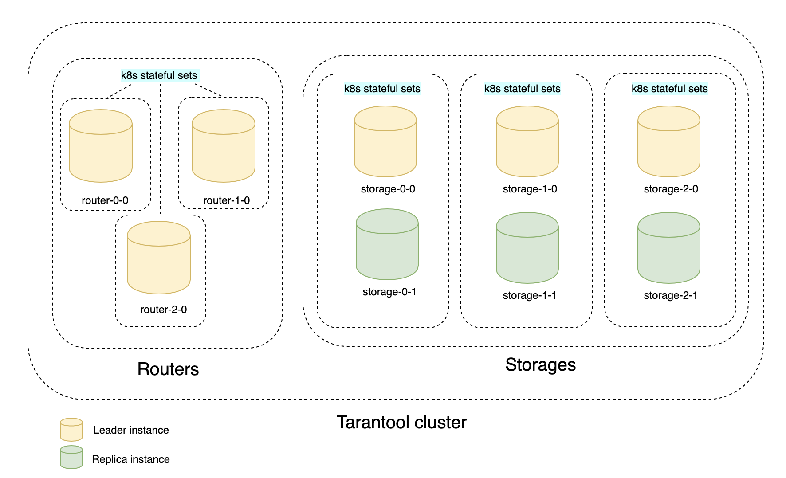
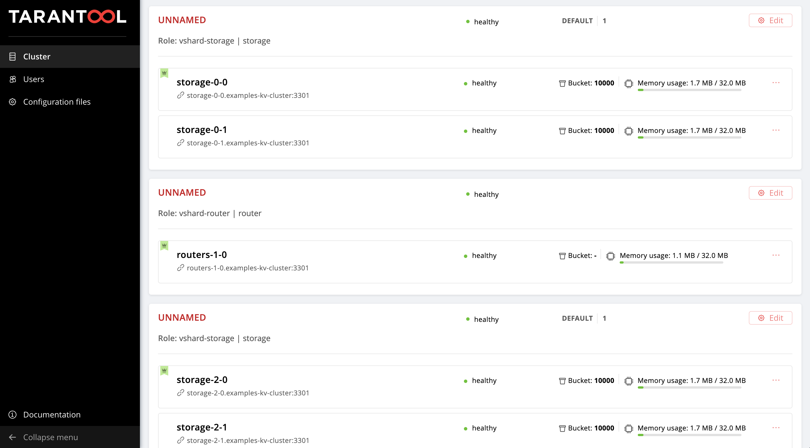

# Tarantool load testing

This repository contains the final project of OTUS database management course.
For educational purposes only.

## Table of contents

* [Environment](#environment)
* [Tarantool Operator](#tarantol-operator)
* [CRUD application](#crud-application)  
  * [Topology](#topology)  
  * [Deploy](#deploy)  
  * [Web UI](#web-ui)  
  * [Scaling](#scaling)  
  * [Clean up](#clean-up)  
* [Deploy Prometheus and Grafana via Helm](#deploy-prometheus-and-grafana-via-helm)
* [Load testing via Yandex.Tank](#load-testing-via-yandextank)  
  * [Read test](#read-test)  
  * [Write test](#write-test)  
  * [Failover test](#failover-test)
* WIP

## Environment

- Kubernetes cluster v1.16.9
- 3 worker nodes (Ubuntu 18.04 LTS 64-bit/2 vCPU/8 GB/30 GB)
- Loader VM (Ubuntu 18.04 LTS 64-bit/8 vCPU/16 GB RAM/5 GB)  

Loader VM is used to run Yandex.Tank load testing from.

Kubernetes cluster and loader VM created in [Selectel Cloud Platform](https://selectel.ru/en/services/cloud/)

## Tarantol Operator

Tarantool operator provides automation that simplifies the administration of Tarantool 
Cartridge-based clusters on Kubernetes.

Apply RBAC manifests:
```bash
kubectl create -f https://raw.githubusercontent.com/tarantool/tarantool-operator/0.0.1/deploy/service_account.yaml
kubectl create -f https://raw.githubusercontent.com/tarantool/tarantool-operator/0.0.1/deploy/role.yaml
kubectl create -f https://raw.githubusercontent.com/tarantool/tarantool-operator/0.0.1/deploy/role_binding.yaml
```

Apply Tarantool CRD's:
```bash
kubectl create -f https://raw.githubusercontent.com/tarantool/tarantool-operator/0.0.1/deploy/crds/tarantool_v1alpha1_cluster_crd.yaml
kubectl create -f https://raw.githubusercontent.com/tarantool/tarantool-operator/0.0.1/deploy/crds/tarantool_v1alpha1_role_crd.yaml
kubectl create -f https://raw.githubusercontent.com/tarantool/tarantool-operator/0.0.1/deploy/crds/tarantool_v1alpha1_replicasettemplate_crd.yaml
``` 

Apply the operator:
```bash
kubectl create -f https://raw.githubusercontent.com/tarantool/tarantool-operator/0.0.1/deploy/operator.yaml
```

It will take a few minutes to get tarantool operator ready:
```bash
kubectl get po
NAME                                  READY   STATUS    RESTARTS   AGE
tarantool-operator-6996c8fbdc-mzwtk   1/1     Running   4          4d8h
```

## CRUD Application

`kv` is just a Tarantool-based distributed key-value storage. Each instance is running along with routers on the same level.  
Data are accessed via HTTP REST API.

Originally taken from tarantool-operator examples:  
https://github.com/tarantool/tarantool-operator/tree/master/examples/kv

### Topology



Router takes and handles incoming HTTP requests. In our schema we have 3 shards of routers, each router is a leader. 
Load balancing between them is handled by Kubernetes Ingress.

Storage controls data storing and handling. We have 3 shards, 2 instances each (master and replica).

### Deploy

```bash
kubectl create -f kv-app/deployment.yaml
```

It will take a few minutes to get cluster ready:
```bash
kubectl get po
NAME                                  READY   STATUS    RESTARTS   AGE
routers-0-0                           1/1     Running   0          4m16s
routers-1-0                           1/1     Running   0          4m16s
routers-2-0                           1/1     Running   0          4m16s
storage-0-0                           1/1     Running   0          4m16s
storage-0-1                           1/1     Running   0          4m4s
storage-1-0                           1/1     Running   0          4m16s
storage-1-1                           1/1     Running   0          4m3s
storage-2-0                           1/1     Running   0          4m16s
storage-2-1                           1/1     Running   0          4m4s
tarantool-operator-6996c8fbdc-mzwtk   1/1     Running   8          4d8h
```

```bash
kubectl get statefulsets
NAME        READY   AGE
routers-0   1/1     4m40s
routers-1   1/1     4m40s
routers-2   1/1     4m40s
storage-0   2/2     4m40s
storage-1   2/2     4m40s
storage-2   2/2     4m40s
```

### Web UI

Get an external IP address of the created LoadBalancer Service:
```bash
kubectl get svc
NAME                  TYPE           CLUSTER-IP       EXTERNAL-IP    PORT(S)             AGE
examples-kv-cluster   ClusterIP      None             <none>         3301/UDP,3302/TCP   5m13s
kubernetes            ClusterIP      10.96.0.1        <none>         443/TCP             4d8h
router                LoadBalancer   10.108.135.233   <EXTERNAL-IP>  8081:30523/TCP      5m12s
```

Open `http://<EXTERNAL-IP>:8081` in your browser to access to web UI. 
You can see the current topology of the cluster:



### Scaling

Add more storage:
```bash
kubectl scale roles.tarantool.io storage --replicas=3
``` 

Add more instances per shard:
```bash
kubectl edit replicasettemplates.tarantool.io storage-template
```

Change ```.spec.replicas``` to desired number of instances per shard.

### Clean up

```bash
kubectl delete -f kv-app/deployment.yaml
```

## Deploy Prometheus and Grafana via Helm

Prometheus + Grafana are used to collect and represent a plenty of metrics in a human-friendly way.  
In our case we will check worker nodes resource utilization.

```bash
helm install prometheus stable/prometheus --set alertmanager.enabled=false \
                                          --set server.persistentVolume.enabled=false \
                                          --set pushgateway.enabled=false \
                                          --set configmapReload.prometheus.enabled=false
```

```bash
helm install grafana stable/grafana
```

## Load testing via Yandex.Tank

WIP

- Read test
- Write test
- Failover test (write but with killed masters)

## Results

WIP
