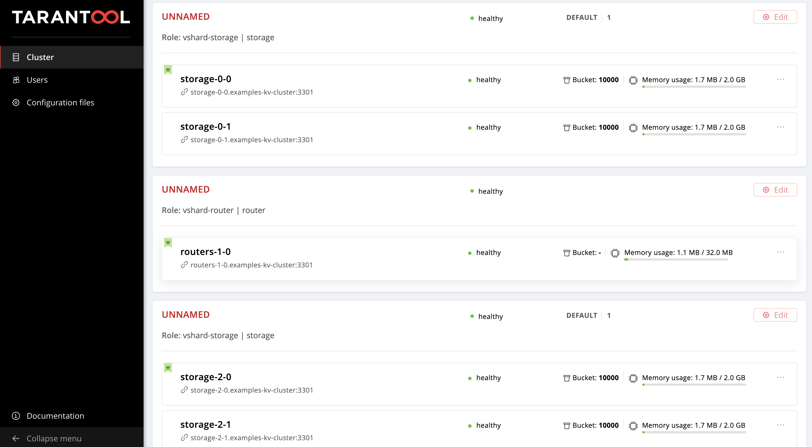
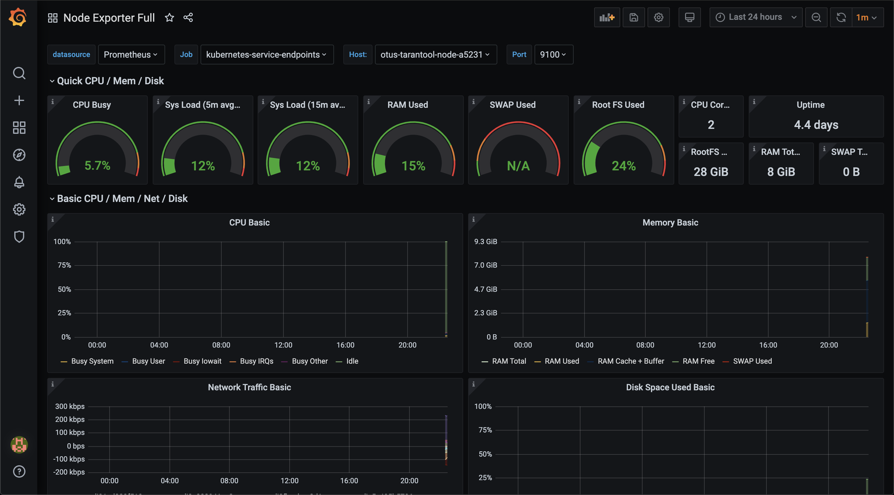
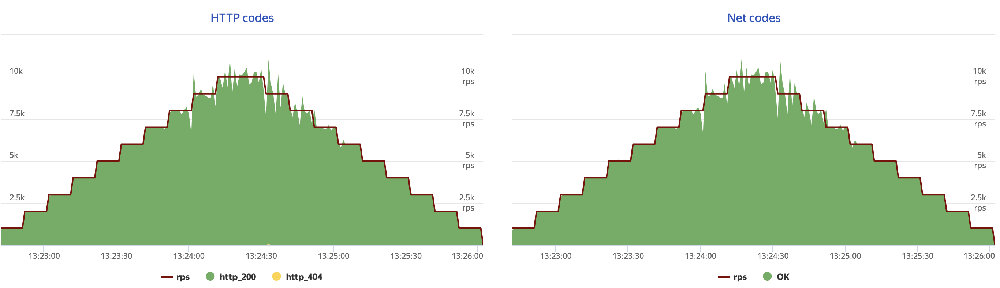
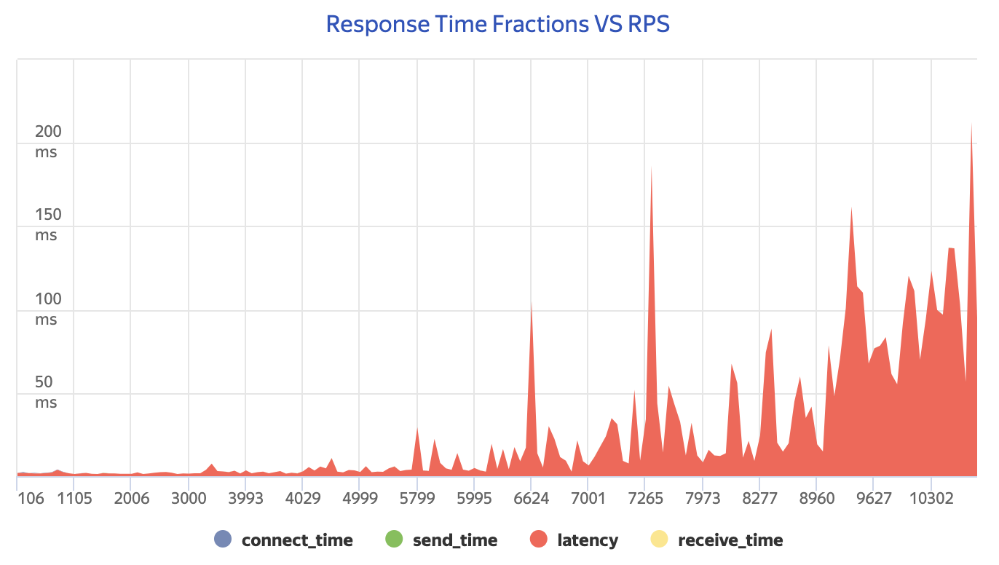
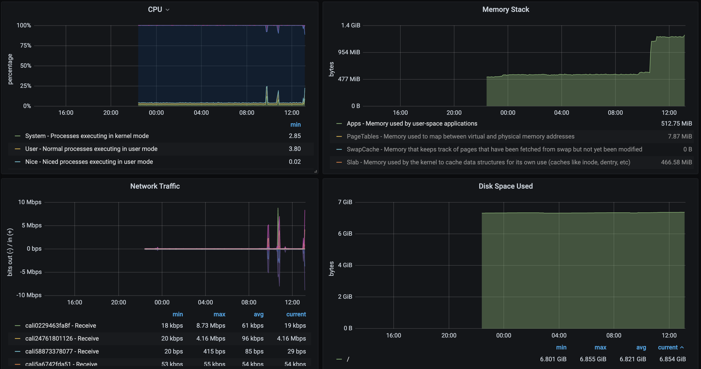

# Tarantool load testing

This repository contains the final project of OTUS database management course.
For educational purposes only.

## Table of contents

* [Environment](#environment)
* [Tarantool Operator](#tarantol-operator)
* [CRUD application](#crud-application)  
  * [Topology](#topology)  
  * [Deploy](#deploy)  
  * [Web UI](#web-ui)  
  * [Scaling](#scaling)  
  * [Clean up](#clean-up)  
* [Deploy Prometheus and Grafana via Helm](#deploy-prometheus-and-grafana-via-helm)
* [Load testing via Yandex.Tank](#load-testing-via-yandextank)  
  * [Install Yandex.Tank](#install-yandextank)
  * [Tune loader VM](#tune-loader-vm)
  * [Write test](#write-test)  
  * [Read test](#read-test)  
  * [Failover test](#failover-test)

## Environment

- Kubernetes cluster v1.16.9
- 3 worker nodes (Ubuntu 18.04 LTS 64-bit/2 vCPU/8 GB/30 GB)
- Loader VM (Ubuntu 18.04 LTS 64-bit/8 vCPU/16 GB RAM/30 GB)  
- Tarantool version: `v1.10.3-136-gc3c087d`
- Yandex.Tank version: `1.12.8.1`

Loader VM is used to run Yandex.Tank load testing from.

Kubernetes cluster and loader VM created in [Selectel Cloud Platform](https://selectel.ru/en/services/cloud/)

## Tarantol Operator

Tarantool operator provides automation that simplifies the administration of Tarantool 
Cartridge-based clusters on Kubernetes.

Apply RBAC manifests:
```bash
kubectl create -f https://raw.githubusercontent.com/tarantool/tarantool-operator/0.0.1/deploy/service_account.yaml
kubectl create -f https://raw.githubusercontent.com/tarantool/tarantool-operator/0.0.1/deploy/role.yaml
kubectl create -f https://raw.githubusercontent.com/tarantool/tarantool-operator/0.0.1/deploy/role_binding.yaml
```

Apply Tarantool CRD's:
```bash
kubectl create -f https://raw.githubusercontent.com/tarantool/tarantool-operator/0.0.1/deploy/crds/tarantool_v1alpha1_cluster_crd.yaml
kubectl create -f https://raw.githubusercontent.com/tarantool/tarantool-operator/0.0.1/deploy/crds/tarantool_v1alpha1_role_crd.yaml
kubectl create -f https://raw.githubusercontent.com/tarantool/tarantool-operator/0.0.1/deploy/crds/tarantool_v1alpha1_replicasettemplate_crd.yaml
``` 

Apply the operator:
```bash
kubectl create -f https://raw.githubusercontent.com/tarantool/tarantool-operator/0.0.1/deploy/operator.yaml
```

It will take a few minutes to get tarantool operator ready:
```bash
kubectl get po
NAME                                  READY   STATUS    RESTARTS   AGE
tarantool-operator-6996c8fbdc-mzwtk   1/1     Running   4          4d8h
```

## CRUD Application

`kv` is just a Tarantool-based distributed key-value storage. Each instance is running along with routers on the same level.  
Data are accessed via HTTP REST API.

Originally taken from tarantool-operator examples:  
https://github.com/tarantool/tarantool-operator/tree/master/examples/kv

### Topology


Router takes and handles incoming HTTP requests. In our schema we have 3 shards of routers, each router is a leader. 
Load balancing between them is handled by Kubernetes Ingress.

Storage controls data storing and handling. We have 3 shards, 2 instances each (master and replica).

### Deploy

```bash
kubectl create -f kv-app/deployment.yaml
```

It will take a few minutes to get cluster ready:
```bash
kubectl get po
NAME                                  READY   STATUS    RESTARTS   AGE
routers-0-0                           1/1     Running   0          4m16s
routers-1-0                           1/1     Running   0          4m16s
routers-2-0                           1/1     Running   0          4m16s
storage-0-0                           1/1     Running   0          4m16s
storage-0-1                           1/1     Running   0          4m4s
storage-1-0                           1/1     Running   0          4m16s
storage-1-1                           1/1     Running   0          4m3s
storage-2-0                           1/1     Running   0          4m16s
storage-2-1                           1/1     Running   0          4m4s
tarantool-operator-6996c8fbdc-mzwtk   1/1     Running   8          4d8h
```

```bash
kubectl get statefulsets
NAME        READY   AGE
routers-0   1/1     4m40s
routers-1   1/1     4m40s
routers-2   1/1     4m40s
storage-0   2/2     4m40s
storage-1   2/2     4m40s
storage-2   2/2     4m40s
```

### Web UI

Get an external IP address of the created LoadBalancer Service:
```bash
kubectl get svc
NAME                  TYPE           CLUSTER-IP       EXTERNAL-IP    PORT(S)             AGE
examples-kv-cluster   ClusterIP      None             <none>         3301/UDP,3302/TCP   5m13s
kubernetes            ClusterIP      10.96.0.1        <none>         443/TCP             4d8h
router                LoadBalancer   10.108.135.233   <EXTERNAL-IP>  8081:30523/TCP      5m12s
```

Open `http://<EXTERNAL-IP>:8081` in your browser to access to web UI. 
You can see the current topology of the cluster:



### Scaling

Add more storage:
```bash
kubectl scale roles.tarantool.io storage --replicas=3
``` 

Add more instances per shard:
```bash
kubectl edit replicasettemplates.tarantool.io storage-template
```

Change ```.spec.replicas``` to desired number of instances per shard.

### Clean up

```bash
kubectl delete -f kv-app/deployment.yaml
```

## Deploy Prometheus and Grafana via Helm

Prometheus + Grafana are used to collect and represent a plenty of metrics in a human-friendly way.  
In our case we will check worker nodes resource utilization.
For the sake of simplicity we won't use persistent storage for metrics.

Install Prometheus using Helm:
```bash
helm install prometheus stable/prometheus --set alertmanager.enabled=false \
                                          --set server.persistentVolume.enabled=false \
                                          --set pushgateway.enabled=false \
                                          --set configmapReload.prometheus.enabled=false
```

Get the Prometheus server URL by running these commands in the same shell:
```bash
export POD_NAME=$(kubectl get pods --namespace default -l "app=prometheus,component=server" -o jsonpath="{.items[0].metadata.name}")
kubectl --namespace default port-forward $POD_NAME 9090
```

Install Grafana using Helm:
```bash
helm install grafana stable/grafana
```

Get Grafana 'admin' user password by running:
```bash
kubectl get secret --namespace default grafana -o jsonpath="{.data.admin-password}" | base64 --decode ; echo
```

Get the Grafana URL to visit by running these commands in the same shell:
```bash
export POD_NAME=$(kubectl get pods --namespace default -l "app=grafana,release=grafana" -o jsonpath="{.items[0].metadata.name}")
kubectl --namespace default port-forward $POD_NAME 3000
```

Open `http://localhost:3000/login` in your browser to access to Grafana UI. Use credentials from previous commands.
Add Prometheus data source and import prepared dashboard (id: 1860).

As a result we can observe the utilization of our worker nodes:



## Load testing via Yandex.Tank

### Install Yandex.Tank

https://yandextank.readthedocs.io/en/latest/install.html#installation-from-pypi

To visualize our test results we use [Overload](https://overload.yandex.net/).

### Tune Loader VM

To achieve top performance we should tune the source server system limits (all commands are running from loader VM):
```bash
ulimit -n 30000
```

Add these lines to `vim /etc/sysctl.conf`:
```bash
net.ipv4.tcp_max_tw_buckets = 65536
net.ipv4.tcp_tw_reuse = 0
net.ipv4.tcp_max_syn_backlog = 131072
net.ipv4.tcp_syn_retries = 3
net.ipv4.tcp_synack_retries = 3
net.ipv4.tcp_retries1 = 3
net.ipv4.tcp_retries2 = 8
net.ipv4.tcp_rmem = 16384 174760 349520
net.ipv4.tcp_wmem = 16384 131072 262144
net.ipv4.tcp_mem = 262144 524288 1048576
net.ipv4.tcp_max_orphans = 65536
net.ipv4.tcp_fin_timeout = 10
net.ipv4.tcp_low_latency = 1
net.ipv4.tcp_syncookies = 0
```

Apply changed by running:
```bash
sysctl -p
```

### Read test

Before running `read` test we generated and uploaded 2 million records: simple key/value pairs.

Example of Yandex.Tank configuration:
```yaml
phantom:
  address: <EXTERNAL_IP>:8081
  instances: 10000 # number of processes (simultaneously working clients)
  uris:
    - <uris to visit>
  load_profile:
    load_type: rps # requests per second load type
    schedule: step(1, 10000, 1000, 10s) step(10000, 1000, 1, 10s) # load from 1 to 10k rpc each 10s then from 10k to 1
  headers:
    - "[Host: <EXTERNAL_IP>]"
    - "[Connection: keep-alive]"
console:
  enabled: true
telegraf:
  enabled: false
overload:
  enabled: true
  package: yandextank.plugins.DataUploader
  token_file: "api_token.txt" # api token to access to Overload
```

Run read test:
```bash
yandex-tank -c load_read.yaml
```

It'll take ~5 minutes to get test finished. After that we can see the results in Overload panel visiting 
the link in the console.

HTTP and NET codes chart:



Latency VS RPC chart:



Nodes utilization during the test:



### Write test

WIP

### Failover test

WIP
